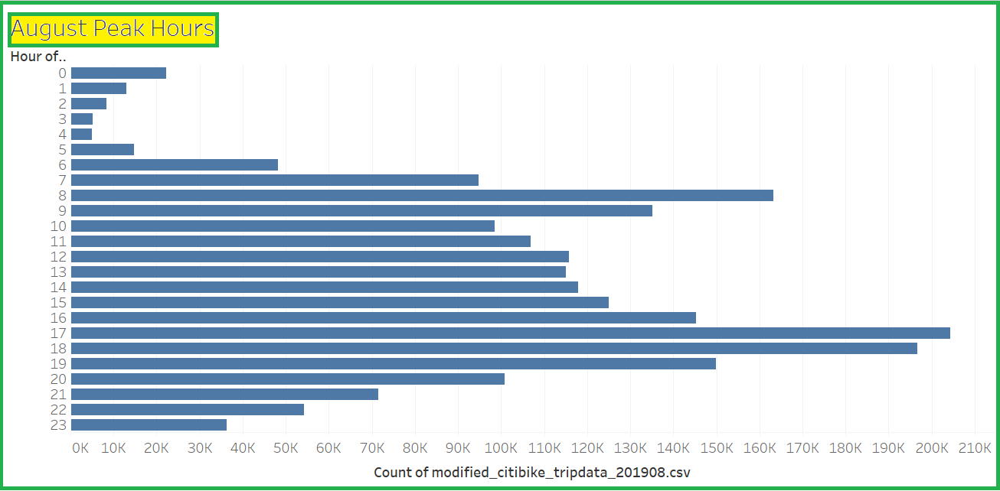
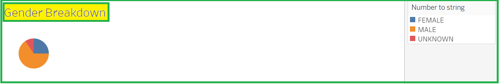
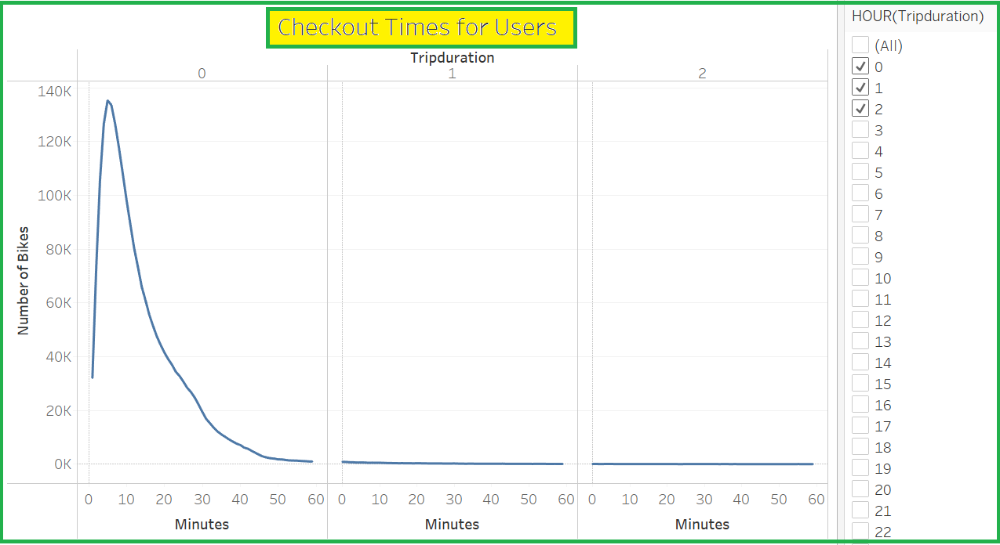
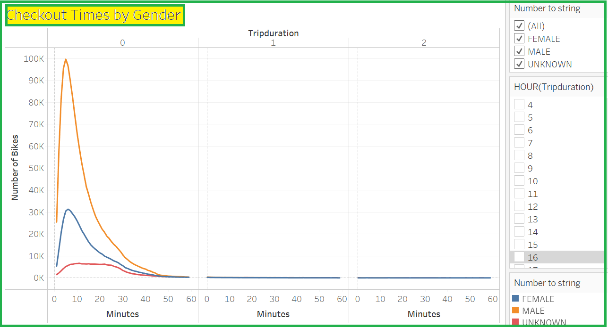
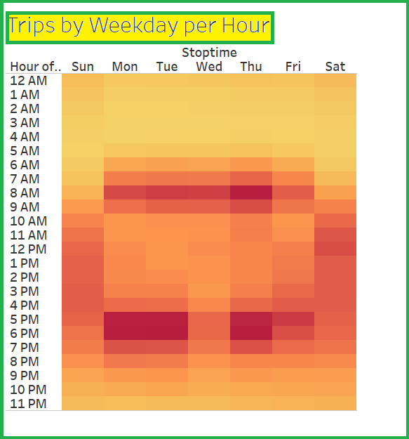
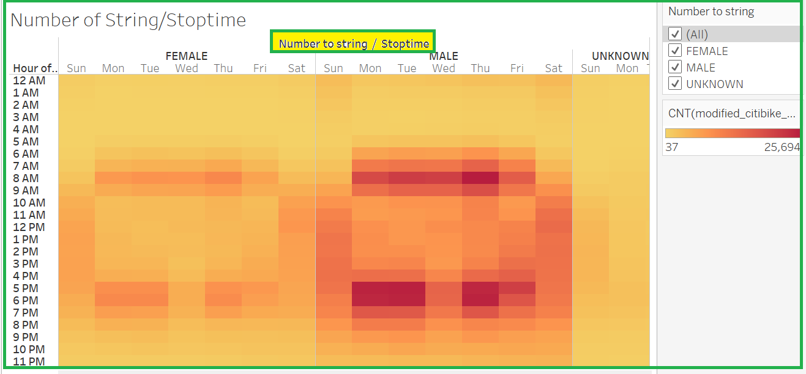
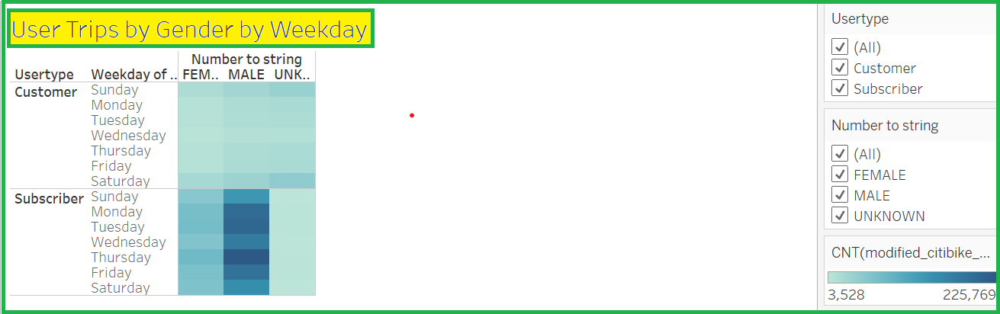

# bikesharing

## Overview of the project

In this project, we were working on bike sharing data-set using tableau. Tableau is a Data Visualisation tool used for
data analysis and business intelligence. It helps create interactive graphs and charts in the form of dashboards and
worksheets to gain business insights. And all of this is made possible with gestures as simple as drag and drop.

## Purpose

The main purpose of this project was to present an analysis using visualizations to convince the investors for the
bike-sharing proposal in Des Moines. In this project, we used Pandas to change the "tripduration" column from an
integer to a datetime datatype. Then, using the converted datatype, a set of visualizations were created to support
the business proposal.

## Results

Based on the above chart, the peak riding hours during august in New York City is 5:00 p.m. to 7:00 p.m. Also we can see that 
2:00 am to 5:00 am are least active riding times, so fewer bikes are needed during this time, which makes it a good time to do
maintenance. 

Based on the above pie chart, we can determine which gender tends to use bike sharing the most. We can see that 65% users
are male, 25% users are female and 10% users are unknown.

Based on the above chart, we can see that most of the bike riders are using bikes for a duration less than 25 minutes.
Maximum number of bike riders ride the bike for just 5 minutes.

Based on the above chart, it is evident that male riders are considerably more than the female riders for any trip
duration measured. The male riders mostly checkout bikes for a duration of 5 minutes whereas the female riders
mostly checkout bikes for a duration of 6 minutes.

Based on the above chart, we can see that most of the trips happen during the morning hours of 6am - 9am and evening
hours of 5pm - 8pm on weekdays. The number of trips are higher in the weekdays than in the weekend.

The above chart shows gender data for the number of bike trips completed for each hour of each day in the week. We can
see that female bike rides are `hot` at 8am and 6pm on weekdays whereas the male rides are `hot` at 8am and between
5pm - 7 pm on weekdays. Both the genders also use the bikes considerably on Saturday between 10am - 5pm.

The above chart shows that `customer` type of users ride mostly in the weekend for both the genders whereas the
`subscriber` type of users ride mostly in the weekdays for both the genders.

## Summary

To summarize, most of the bike riders are male and they ride mostly in the morning and evening hours in the weekdays. Most of the
users in the weekdays belong to the "Subscriber" type of the users whereas the users in the weekend belong to the "Customer"
type. Most of the riders use the bike for less than 6 minutes be it any gender.

We can add the following two visualizations to our analysis:
- We can plot number of rides for a given pair of start station id and end station id. This will help us know which routes
are popular or most crowded.
- We can also plot number of rides for a start station id and a trip duration combination to find out the stations where
the durations are high. This will give us a list of stations where we might need more bikes to service demand.

[Link to Story] (https://public.tableau.com/app/profile/shruti.bansal1040/viz/Challenge_16554207208390/BikeSharingDataAnalysisStory?publish=yes)